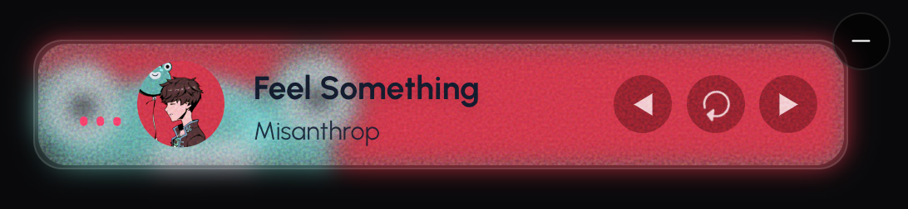

# Music Player Widget

A lightweight React music player widget with a sleek, modern UI. Features include play/pause, next/previous track, minimize/expand toggle, and preloaded audio tracks. Built with TypeScript, Framer Motion, Ionic, and Lottie for smooth animations and interactivity.

## Installation

Install via npm:

```bash
npm install @lijuu/musicplayerwidget
```

Install peer dependencies:

```bash
npm install react react-dom framer-motion @ionic/react lottie-web @ionic/core ionicons
```
## Screenshots

| Preview | Playing | Loading | Minimized |
|---------|---------|---------|-----------|
|  |  |  |  |

## Usage

Import the `MusicPlayer` component and add it to your React app. Configure Ionic in your app's entry file.

### Example

```tsx
// src/index.tsx
import React from 'react';
import ReactDOM from 'react-dom/client';
import App from './App';
import "@ionic/react/css/core.css";
import "@ionic/react/css/normalize.css";
import "@ionic/react/css/structure.css";
import "@ionic/react/css/typography.css";
import { setupIonicReact } from "@ionic/react";

setupIonicReact();

const root = ReactDOM.createRoot(document.getElementById('root')!);
root.render(
  <React.StrictMode>
    <App />
  </React.StrictMode>
);

// src/App.tsx
import React from "react";
import { MusicPlayer, Track } from "@lijuu/musicplayerwidget";

const customTracks: Track[] = [
  {
    title: "Custom Song",
    artist: "Artist Name",
    url: "https://example.com/song.mp3",
    image: "https://example.com/image.jpg",
  },
];

const App: React.FC = () => (
  <MusicPlayer className="bottom-4 right-4" newTrack={customTracks} />
);

export default App;
```

## Props

| Prop           | Type                              | Description                                      | Default |
|----------------|-----------------------------------|--------------------------------------------------|---------|
| `className`    | `string`                          | Custom CSS classes for positioning/styling       | `""`    |
| `newTrack`     | `Track[]`                         | Array of custom tracks to append to default list | `undefined` |
| `audioRefProp` | `React.MutableRefObject<HTMLAudioElement>` | Custom audio element ref for external control | `undefined` |

### Track Interface

```typescript
interface Track {
  title: string;
  artist: string;
  url: string;
  image: string;
}
```

## Features

- **Preloaded Tracks**: Includes six preloaded tracks (not lightweight; you can replace them with your own).
- **Loading Indicator**: Shows a spinner until the track is fully buffered.
- **Controls**: Play/pause, next/previous track with smooth animations.
- **Minimize/Expand**: Toggle between compact and full view.
- **Visuals**: Lottie sound bars, blurred background, and grain overlay.
- **Responsive**: Adapts to screen size with mobile-friendly design.

## Requirements

- React 17+ or 18+
- Node.js 18+ for development
